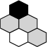

#  Hex Game

This project is a Hex game implemented using React. The game allows two players to compete on a hexagonal board, with the goal of forming a connected path of their color linking two opposite sides of the board. The game logic relies on disjoint-set data structures to determine the winner.

## ♟️ How to Play

The game is played on a two-dimensional board by two players. Your goal is to form a connected path of your color, linking two opposite sides of the board: `Player 1` connects top and bottom, while `Player 2` connects left and right.
The player who completes such a connection wins the game!

### 🎮 Game Modes

Currently, the game has two modes:
- 🏖️ `Sandbox`: Can be played by either one or two players using the same device.
- 🤖 `Versus AI`: Play against the AI.

### 🔄 The Swap Rule

`Player 1` always gains the initiative, and will therefore have a major advantage. If checked at the game setup, `Player 2` will have the choice to swap moves with `Player 1` after the first turn.

### 🎨 Color Schemes

There are two available color schemes:
-  **Black-White:**
  - `Black` connects top and bottom.
  - `White` connects left and right.
-  **Red-Blue:**
  - `Red` connects top and bottom.
  - `Blue` connects left and right.

## 📋 Prerequisites

- Node.js
- npm or yarn

### 🛠️ Installation

1. Clone the repository.
    
2. Install dependencies:
    ```sh
    npm install
    # or
    yarn install
    ```

### 🚀 Running the Game

1. Start the development server:
    ```sh
    npm run dev
    # or
    yarn dev
    ```

2. Open your browser and navigate to the localhost address to play the game.

### 🏗️ Building for Production

To create a production build, run:
```sh
npm run build
# or
yarn build
